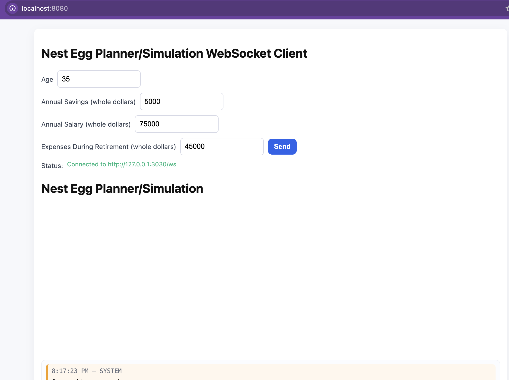
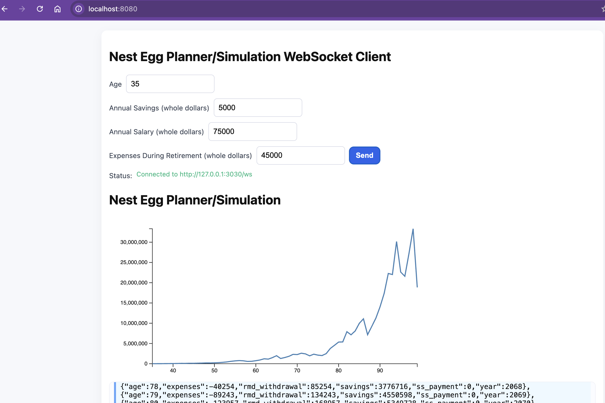
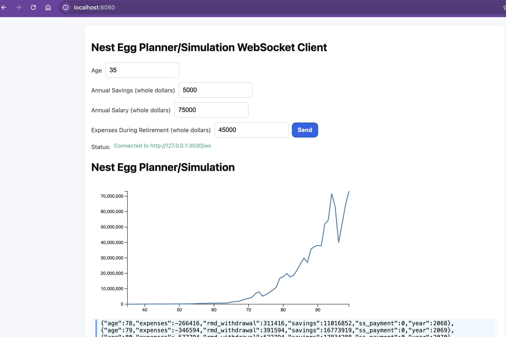
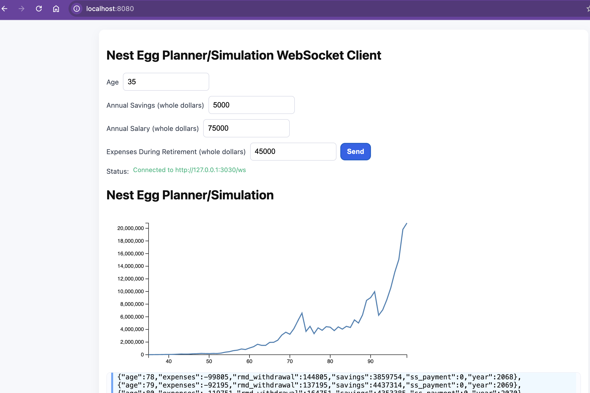

# Retirement "Nest Egg" Planner/Simulator Proposal
Author: Farani "Rani" Lucero 2025

This program is a Retirement Planner/Simulator to
help understand how your savings "nest egg" can 
grow or not grow over time.

This program uses a websocket server (on 127.0.0.1:3030). From the root of this project run the following:

```rust
cargo run --release
```

To start the web front end (from the client folder), run the following:

```rust
cd client
cargo run --release
```

Open your browser to [http://127.0.0.1:8080](http://127.0.0.1:8080)


# Usage
Clicking on send calls the server to calculate the savings across retirement.







# Github Repo
https://github.com/rluceropdx/nest-egg-planner


# Project Objectives
Develop a "clicker-style" simulator but with a focus on building retirement savings. I intend to keep some things simple (having only 1 or 2 accounts) but extend the range of simulated events such as:
- RMD's (Required Minimum Distributions). IRS forced withdrawals starting at age 75 for those born 1960 or after.
- Roth vs Tax-Advantaged accounts
- Tax Calculation (married filing jointly, single, having dependents)
- Incorporate an average of expenses and the effects inflation
- Health care costs and the effects of inflation
- Recieving Social Security & enrolling in medicare
- Medicare Premiums and it potentially increasing due to RMDs above
- Situations when Social Security is taxed


## Acknowledgments
I used Bart Massey's LICENSE.txt as example for mine.

## License

This work is made available under the "Apache 2.0 or MIT
License". See the file `LICENSE.txt` in this distribution for
license terms.
